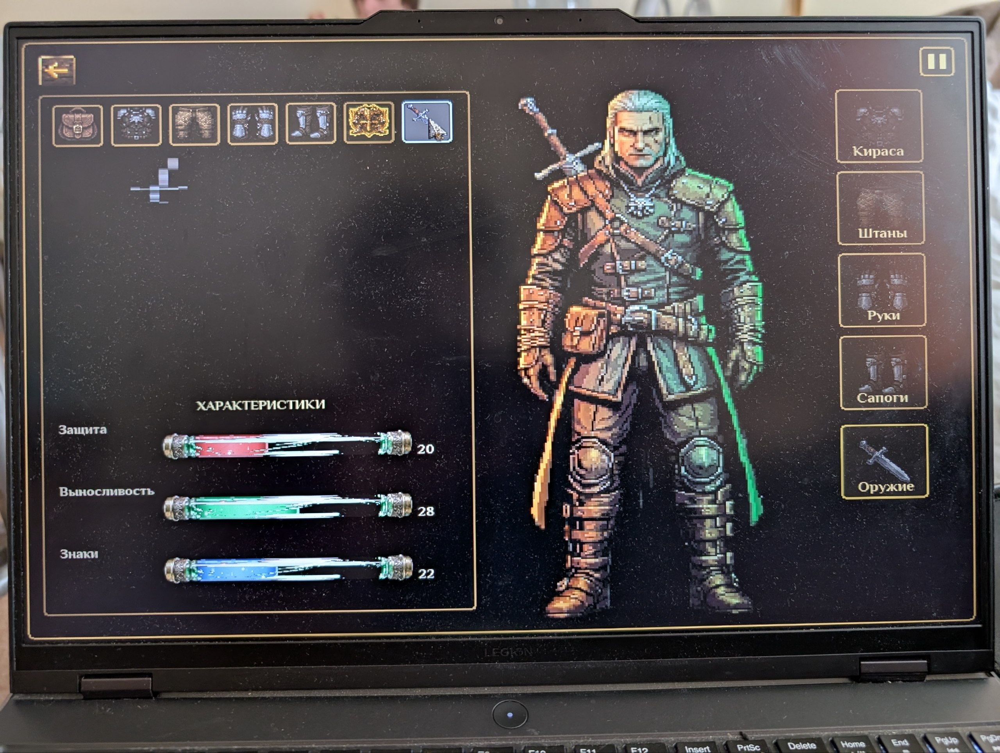

# UI-002 [UI] Нежеданный отклик интерфейса в инвентаре

## Основная информация
| Поле | Значение |
|---|---|
| **ID** | UI-002 |
| **Тип** | UI / Functional |
| **Severity** | Major |
| **Priority** | Medium |
| **Дата** | 17.09.2026 |
| **Версия** | 1.0 |

## Окружение
| Параметр | Значение |
|---|---|
| OS | Windows 11 |
| Разрешение | 2560x1600 |

## Предусловия
1. Игра установлена и запускается.

## Шаги воспроизведения:
1. Дойти до магазина.
2. Купить предмет.
3. Открыть инвентарь.
4. Выбрать категорию мечей.

## Ожидаемый результат: 
Ячейка оружия не подсвечивается.  

## Текущий результат: 
Ячейка оружия подсвечивается.  
В магазине, при наведении на вкладку меча в инвентаре, реагирует ячейка экипировки (подсвечивается).

# Частота
Постоянный.

## Вложения

## Комментарий:
Не критический. Влияет на восприятие.